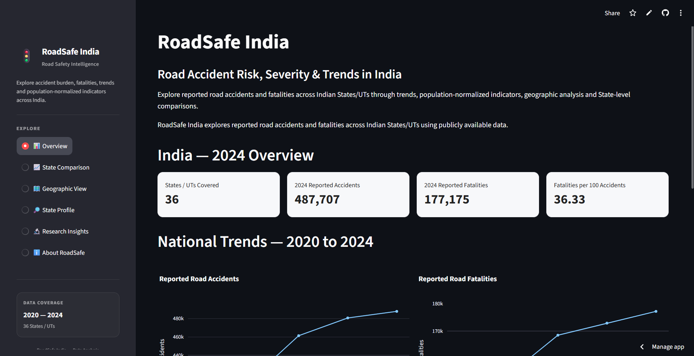
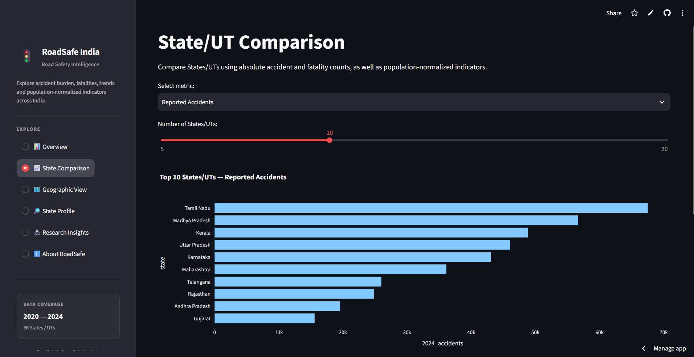
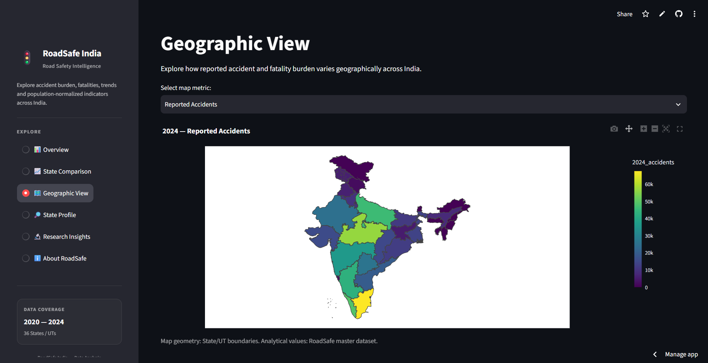
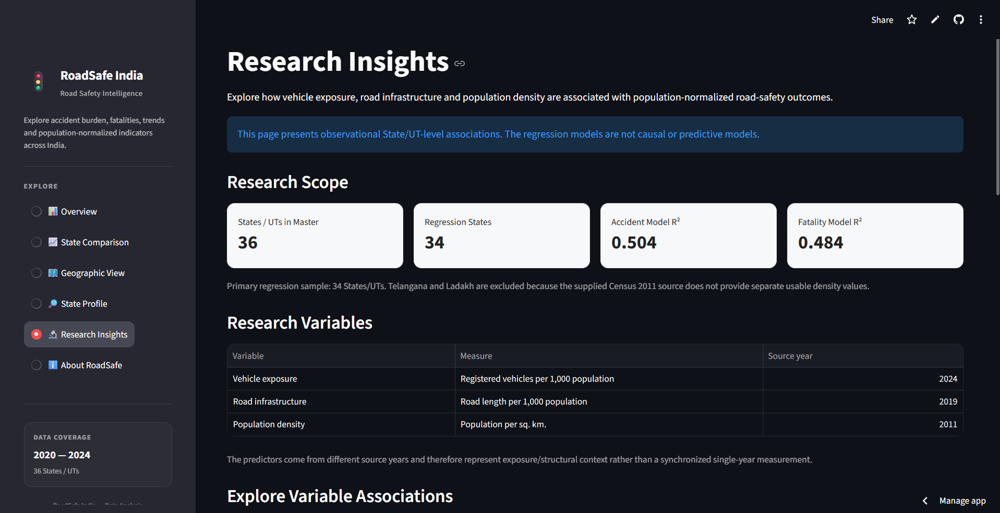

# 🚦 RoadSafe India

## A Data-Driven Analysis of Road Accident Risk, Severity and Trends in India

> 🚦 **Project Status:** Completed & Actively Maintained  
> 📊 **36 States/UTs** | 📅 **2020–2024** | 🧪 **11 Tests Passing** | 🔬 **Research Analysis Included**

RoadSafe India is a data visualization and data analysis project that
examines reported road accidents and road fatalities across Indian
States/UTs.

The project combines multi-year accident data, fatality data and projected
population data to identify patterns in accident burden, fatality burden,
population-normalized indicators and State/UT-level trends.

The project also provides an interactive Streamlit dashboard for exploring
the results.

---

## 🖥️ Dashboard Preview
### Overview


### State Comparison


### Geographic View


### Research Insights


---

### 🚀 Live Dashboard

[Open RoadSafe India Dashboard](https://roadsafe-india.streamlit.app/)

---

## 🛠️ Technologies Used

- **Python** — Data analysis and processing
- **Pandas** — Data manipulation
- **NumPy** — Numerical computation
- **Plotly** — Interactive visualizations
- **Streamlit** — Interactive dashboard
- **GeoPandas** — Geographic data processing
- **Statsmodels** — Statistical analysis and regression
- **Pytest** — Automated testing
- **Git & GitHub** — Version control and project management

---

## ⭐ Project Highlights

- **36 States/UTs** analyzed across **2020–2024**
- **487,707 reported road accidents** and **177,175 reported fatalities** analyzed for 2024
- Developed population-normalized safety indicators for meaningful State/UT comparison
- Integrated **2024 vehicle exposure**, **2019 road infrastructure**, and **2011 population density** data
- Built **3-predictor multivariable regression models** for accident and fatality rates
- Used **HC3 robust standard errors**, multicollinearity checks, diagnostic tests, and sensitivity analysis
- Built an interactive **Streamlit dashboard** with State comparison, geographic visualization, State profiles, and research insights
- Added automated testing with **11 passing tests**
- Designed the project as a **reproducible data-analysis pipeline** using Python, Git and GitHub

---

## 📌 Problem Statement

Road accidents represent an important public-safety challenge in India.

Looking only at the total number of accidents does not provide a complete
picture of the problem. States/UTs differ substantially in population size,
and accident burden and fatality burden do not always produce identical
rankings.

RoadSafe India therefore examines the problem from multiple perspectives:

- Absolute accident burden
- Absolute fatality burden
- Population-normalized accident burden
- Population-normalized fatality burden
- Fatalities relative to reported accidents
- Multi-year trends
- Relationships between accident and fatality counts

---

## 🎯 Project Objectives

The primary objectives of RoadSafe India are to:

1. Analyze reported road accidents across Indian States/UTs.
2. Analyze reported road fatalities across Indian States/UTs.
3. Compare States/UTs using both absolute and population-normalized measures.
4. Study accident and fatality trends from 2020 to 2024.
5. Examine the relationship between reported accidents and fatalities.
6. Provide an interactive dashboard for exploring the results.
7. Establish a reproducible and testable data-analysis pipeline.

---

## ❓ Key Questions

RoadSafe India is designed to answer questions such as:

- How many road accidents were reported in India?
- How many road fatalities were reported?
- Which States/UTs have the highest accident burden?
- Which States/UTs have the highest fatality burden?
- How do rankings change after population normalization?
- Which States/UTs show persistent high fatality burden?
- How have accident and fatality counts changed between 2020 and 2024?
- Is there a statistical relationship between reported accidents and fatalities?
- Does the accident-fatality relationship remain strong after accounting for
  population differences?

---

# 🗓️ Study Period

**2020–2024**

The analysis uses State/UT-level observations.

---

# 📊 Key Metrics

The project uses several complementary indicators.

### Reported Accidents

The number of reported road accidents.

### Reported Fatalities

The number of reported road fatalities.

### Accidents per 100,000 Projected Population

Calculated as:

    Reported Accidents
    ------------------ × 100,000
    Projected Population

### Fatalities per 100,000 Projected Population

Calculated as:

    Reported Fatalities
    ------------------- × 100,000
    Projected Population

### Fatalities per 100 Reported Accidents

Calculated as:

    Reported Fatalities
    ------------------- × 100
    Reported Accidents

This metric should NOT be interpreted as the probability that an individual
involved in an accident will die. The denominator represents reported
accidents rather than people involved in those accidents.

---

# 🔬 Methodology

The project follows the following analytical pipeline:

    Data Sources
         ↓
    Data Understanding
         ↓
    Data Cleaning
         ↓
    Exploratory Data Analysis
         ↓
    Contextual Population Data
         ↓
    Accident Analysis
         ↓
    Fatality Analysis
         ↓
    Accident-Fatality Relationship Analysis
         ↓
    Research Extension
         ↓
    Multivariable Regression
         ↓
    Diagnostics and Robustness
         ↓
    Interactive Dashboard

---

# 📈 Analysis Performed

## Accident Analysis

The project examines:

- State/UT accident counts
- 2024 accident burden
- Accident rates per 100,000 projected population
- 2020–2024 accident trends
- Five-year accident averages
- Change between 2020 and 2024

## Fatality Analysis

The project examines:

- State/UT fatality counts
- 2024 fatality burden
- Fatality rates per 100,000 projected population
- Fatalities per 100 reported accidents
- 2020–2024 fatality trends
- Five-year average fatality burden
- Persistent high-fatality States/UTs

## Relationship Analysis

The project examines the relationship between:

- Population and reported accidents
- Population and reported fatalities
- Reported accidents and reported fatalities

A residual-based analysis is also used to examine the accident-fatality
relationship after accounting for the linear association of population with
both variables.

## Statistical Analysis

The project uses:

- Descriptive statistics
- Pearson correlation
- Spearman correlation
- p-values
- Population-adjusted residual analysis

---

# 📊 Key Statistical Findings

For the 2024 State/UT-level dataset:

| Relationship | Pearson Correlation |
|---|---:|
| Population vs Accidents | 0.6715 |
| Population vs Fatalities | 0.9076 |
| Accidents vs Fatalities | 0.8632 |
| Accidents vs Fatalities after accounting for Population | 0.8156 |

The accident-fatality relationship remains strong after accounting for the
linear association of population with both variables.

The statistical results represent observational State/UT-level associations
and should not be interpreted as evidence of causation.

---

## 🔬 Research Extension & Multivariable Analysis

To move beyond descriptive accident statistics, RoadSafe India incorporates
state-level exposure and structural variables to examine associations with
population-normalized road safety outcomes.

### Research Variables

| Variable | Definition | Source year |
|---|---|---:|
| Vehicle exposure | Registered vehicles per 1,000 population | 2024 |
| Road infrastructure | Road length per 1,000 population | 2019 |
| Population density | Population per sq. km. | 2011 |

The analysis uses:

- `accidents_per_100k_population` as the accident-rate outcome
- `fatalities_per_100k_population` as the fatality-rate outcome

### Multivariable Regression

Three predictors are included simultaneously:

1. Vehicle registrations per 1,000 population
2. Road length per 1,000 population
3. Population density

The primary regression models use **HC3 robust standard errors**.

#### Accident-rate model

- Observations: 34 states/UTs
- R²: **0.5036**
- Adjusted R²: **0.4539**

| Predictor | Coefficient | HC3 p-value |
|---|---:|---:|
| Vehicle exposure | +2.9705 | **0.0030** |
| Road-length density | −0.5668 | 0.4611 |
| Population density | −0.0058 | 0.0540 |

#### Fatality-rate model

- Observations: 34 states/UTs
- R²: **0.4844**
- Adjusted R²: **0.4328**

| Predictor | Coefficient | HC3 p-value |
|---|---:|---:|
| Vehicle exposure | +0.3893 | **0.0038** |
| Road-length density | −0.2242 | 0.3076 |
| Population density | −0.0012 | **0.0209** |

### Key Findings

- Vehicle exposure shows a **positive and statistically significant association**
  with both accident and fatality rates.
- Population density shows a **negative association**, with stronger statistical
  evidence for fatality rates.
- Road-length density does not show a consistently significant independent
  association after controlling for the other predictors.
- Adding population density significantly improves both the accident-rate and
  fatality-rate models.
- Sensitivity analysis shows that vehicle exposure remains positive and
  statistically significant after excluding influential states.
- Log-transformed outcome models provide broadly consistent robustness evidence.

### Model Diagnostics

The regression analysis includes:

- Variance Inflation Factor (VIF)
- Pearson and Spearman predictor correlations
- Breusch–Pagan heteroskedasticity test
- Omnibus and Jarque–Bera residual-normality tests
- Cook's distance influence analysis
- Same-sample nested-model comparisons
- Log-outcome robustness analysis

The three predictors showed low multicollinearity, with VIF values between
approximately **1.10 and 1.27**.

### Important Limitations

The research extension is **observational and associational**, not causal.

The predictor variables come from different source years:

- Vehicle exposure: 2024
- Road infrastructure: 2019
- Population density: 2011

Therefore, the models should not be interpreted as causal or predictive models.

The supplied Census 2011 source does not provide separate observations for
**Ladakh** or **Telangana**. These states are therefore excluded from the
regression analyses requiring population density rather than being assigned
fabricated or imputed values.

Several observations, particularly **Goa, Arunachal Pradesh, and Delhi**, show
relatively high influence in some regression specifications. Their influence
was evaluated through sensitivity analysis rather than removing them from the
primary model.

---

# 💡 Important Findings

Some of the notable findings from the analysis include:

- Tamil Nadu recorded the highest number of reported accidents in 2024 in the
  analyzed dataset.
- Uttar Pradesh recorded the highest number of reported fatalities in 2024.
- The States/UTs with the highest absolute burden are not necessarily the
  same as those with the highest population-normalized burden.
- A consistent group of States/UTs remained among the highest reported-fatality
  States throughout the 2020–2024 period.
- Reported accident counts and reported fatalities show a strong positive
  statistical association.

These findings are descriptive and are intended to identify patterns and
areas for further investigation.

---

# 🖥️ Interactive Dashboard

The RoadSafe India dashboard is built using:

- **Streamlit** — interactive web application
- **Plotly** — interactive visualizations
- **Pandas** — data manipulation and analysis

The dashboard contains:

### 📊 Overview

Provides:

- 2024 accident and fatality KPIs
- National accident trend
- National fatality trend
- Automatically generated key insights

### 📈 State Comparison

Allows users to compare States/UTs using:

- Reported accidents
- Reported fatalities
- Accidents per 100k population
- Fatalities per 100k population
- Fatalities per 100 reported accidents

The number of displayed States/UTs can also be adjusted interactively.

### 🗺️ Geographic View

Provides an interactive India State/UT map for:

- Reported accidents
- Reported fatalities
- Accidents per 100k population
- Fatalities per 100k population

### 🔎 State Profile

Users can select a State/UT and view:

- 2024 accident count
- 2024 fatality count
- Accident rate
- Fatality rate
- Fatalities per 100 reported accidents
- National rankings
- Comparison with average State/UT values
- Historical accident trend
- Historical fatality trend

### ℹ️ About RoadSafe

Provides project methodology, definitions and limitations.

---

# 🏗️ Project Architecture

```text
                    ROADSAFE INDIA

                         DATA
                          │
          ┌───────────────┼───────────────┐
          ▼               ▼               ▼
      Accidents       Fatalities       Population
          │               │               │
          └───────────────┼───────────────┘
                          ▼
                   Data Cleaning
                          │
                          ▼
                Master Analytical Data
                          │
             ┌────────────┼────────────┐
             ▼            ▼            ▼
         Analysis     Statistics    Insights
             │            │            │
             └────────────┼────────────┘
                          ▼
                    Streamlit App
                          │
                          ▼
                  Interactive Dashboard
```
---

# 📁 Repository Structure
```text
RoadSafe-India/
│
├── app/
│   └── app.py
│
├── data/
│   ├── raw/
│   ├── processed/
│   |── external/
|   └── research/
│
├── notebooks/
│   ├── 01_data_understanding.ipynb
│   ├── 02_data_cleaning.ipynb
│   ├── 03_eda.ipynb
│   ├── ...
│   └── 17_population_density_data.ipynb
│
├── src/
│   ├── data_loader.py
│   ├── insights.py
│   ├── prepare_state_geojson.py
│   └── fix_state_geometry.py
│
├── tests/
│   ├── test_data_loader.py
│   └── test_dashboard_metrics.py
│
├── reports/
├── assets/
│
├── .gitignore
├── pytest.ini
├── requirements.txt
└── README.md
```
---

# ⚙️ Installation
1. Clone the repository
```bash
git clone <https://github.com/Samarth-B-8/RoadSafe-India.git>
cd RoadSafe-India
```

2. Create a virtual environment
```bash
python -m venv .venv
```
3. Activate the virtual environment
Windows PowerShell
```bash
.venv\Scripts\Activate
```

4. Install Dependencies
```bash
pip install -r requirements.txt
```
---

# ▶️ Running the Dashboard
From the project root
```bash
python -m streamlit run app/app.py
```
Then open the local Streamlit URL shown in the terminal, usually:
```bash
http://localhost:8501
```
---

# 🧪 Running Tests
The project includes automated validation tests using pytest.
```bash
pytest
```
The tests validate important analytical assumptions including:

* State/UT coverage
* Duplicate State/UT detection
* National accident totals
* National fatality totals
* Highest accident and fatality States
* Rate calculations
* Fatality-to-accident calculations
* Automated insight generation
* Accident-fatality correlation

The current test suite contains 11 tests, all of which pass.

---

# ⚠️ Limitations
RoadSafe India is an observational State/UT-level analysis and has several important limitations.
1. Population is an exposure proxy
Population-normalized indicators do not directly measure traffic exposure, vehicle-kilometres travelled, road usage, or time spent on roads.
2. Population values are projected
The 2024 population denominator used in the analysis consists of projected population values rather than a 2024 Census enumeration.
3. Reported data
The analysis uses reported accident and fatality data. Differences in
reporting and data-collection practices may therefore influence the results.
4. Aggregated observations
The statistical analysis uses State/UT-level observations rather than
individual accident records.
5. Correlation is not causation
Strong statistical relationships do not establish that one variable causes another.
6. Fatalities per 100 reported accidents is a proxy
This indicator should not be interpreted as the probability of death for a person involved in an accident.
7. 2020–2021 require caution
The early part of the study period was affected by exceptional mobility conditions. Temporal changes across the period should therefore be interpreted carefully.
8. Geographic boundary limitations
The dashboard's map geometry is a visualization layer. Analytical values come from the RoadSafe master dataset and are not derived from map geometry.

---

# 🚀 Future Improvements
Potential future extensions include:

* Additional accident-level datasets
* Road-user category analysis
* Vehicle-type analysis
* Road-condition analysis
* Weather and environmental context
* Traffic-volume or vehicle-kilometre exposure data
* District-level analysis
* Spatial hotspot analysis
* More advanced statistical modelling
* Predictive machine-learning models where suitable data are available
* Deployment of the dashboard as a public web application

These features should only be added when suitable and reliable data are available.

---

# 🧠 What Makes RoadSafe Different?
RoadSafe does not rely on a single "dangerous state" ranking.
Instead, it examines road safety through multiple dimensions:
```text
                    ROAD SAFETY
                         │
        ┌────────────────┼────────────────┐
        ▼                ▼                ▼
      Burden           Rate             Trend
        │                │                │
   Accidents         Accidents/100k    2020–2024
   Fatalities        Fatalities/100k   changes
        │
        ▼
   Relationship
        │
   Accidents ↔ Fatalities
```
This allows users to distinguish between:
* States with a high absolute burden
* States with a high burden relative to population
* States with persistent high fatality levels
* States whose accident and fatality patterns differ

---

# 🛠️ Technology Stack
| Technology | Purpose                        |
| ---------- | ------------------------------ |
| Python     | Core programming language      |
| Pandas     | Data manipulation and analysis |
| NumPy      | Numerical computation          |
| Matplotlib | Exploratory visualizations     |
| Plotly     | Interactive visualizations     |
| SciPy      | Statistical analysis           |
| GeoPandas  | Geographic data processing     |
| Streamlit  | Interactive dashboard          |
| Pytest     | Automated testing              |
| Git/GitHub | Version control                |

---

# 📌 Project Status
Current Stage
- ✅ Data Collection
- ✅ Data Understanding
- ✅ Data Cleaning
- ✅ Exploratory Analysis
- ✅ Trend Analysis    
- ✅ Fatality Analysis
- ✅ Statistical Analysis   
- ✅ Master Dataset   
- ✅ Interactive Dashboard
- ✅ Geographic Visualization
- ✅ Automated Testing  
- ✅ Documentation            

---

# 👤 Author
<b>Samarth B</b><br>
<b>Computer Science and Engineering</b><br>
<b>JSS Science and Technology University, Mysuru</b><br>

---

# 📄 Disclaimer
RoadSafe India is an academic and analytical project intended for exploration, visualization and research.

The indicators presented in the dashboard should not be interpreted as official rankings of road-safety risk or as causal explanations of differences between States/UTs.